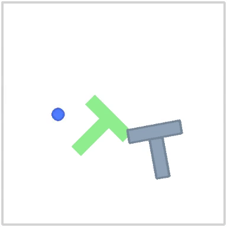

# 22-Day Robotics Challenge

Learning robotics from scratch, one day at a time.

## Day 1 — 2026-07-16

Installed [LeRobot](https://github.com/huggingface/lerobot) 0.6.0 in a Python
venv on WSL2 (Ubuntu 24.04, RTX 4060) and ran the pretrained diffusion policy
`lerobot/diffusion_pusht` in the PushT simulator on GPU.

Result: 2/3 episodes successful, in line with the model's reported ~64%
success rate. One wrinkle: the Hub checkpoint is in LeRobot's old format and
had to be converted with the bundled `migrate_policy_normalization` script
before `lerobot-eval` would load it.

