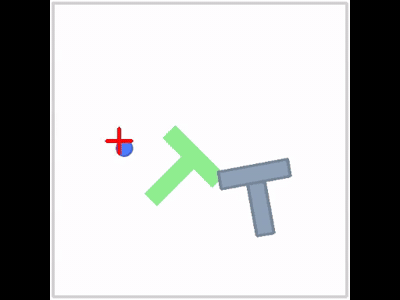

# 22-Day Robotics Challenge

Learning robotics in public, one day at a time — a game developer's first
contact with imitation learning, new to both robotics and Python. One project
across all 22 days: run pretrained policies, train my own, and build the eval
dashboard that keeps every number honest.



**Live dashboard:** <https://robotics-challenge-dashboard.onrender.com> —
leaderboard, per-episode metrics, and rollout videos, served straight from the
evidence files in this repo. Free tier: the first load after it idles takes
about a minute to wake up.

## The leaderboard

Every number carries a protocol label, because comparisons only mean something
within one ruler.

**PushT** — frozen-500 protocol (LeRobot 0.6.0, `lerobot-eval`):

| policy | success | notes |
|---|---|---|
| pretrained-diffusion | **61.0%** | official `lerobot/diffusion_pusht` checkpoint, migrated |
| diffusion-scratch | **39.8%** | mine, 90k steps, one overnight on an RTX 4060 |
| act-pusht | **0.8%** | ACT at default settings — an honest failure, kept on the board |

**xarm lift** — frozen-500 protocol (hand-written BC loop, day 14 onward):

| policy | success | notes |
|---|---|---|
| bc-mlp-sighted | **99.0%** | oracle demos, cube xyz in the state vector |
| bc-mlp-blind-control | **4.2%** | same demos, cube stripped from the state — the ablation |
| bc-mlp-blind | **0.0%** | TD-MPC demos, no cube in state |

Off-ruler results (real numbers, different protocols, listed separately on
purpose): ACT-pusht hits 11% with `n_action_steps=8` (inference knob sweep);
pretrained ACT on ALOHA transfer-cube got 7/10 over 10 episodes; the scripted
xarm oracle goes 20/20 but reads the true cube position (it exists to validate
the benchmark, not to compete on it).

## The frozen protocols (the rulers)

- **PushT frozen-500:** 500 episodes, `batch_size=4`, `use_async_envs=false`,
  seed 1000, cuda. Established day 1, never changed. ±4 pts sampling error.
- **xarm frozen-500:** 500 episodes, `reset(seed=1000+i)`, 300-step cap,
  success = cube ≥ 15cm above spawn (patched success check). Established day 14.

Runs on the frozen ruler are labeled `frozen-500` by the API; everything else
is `exploratory`. Each run also carries a provenance label — whether its launch
command survives in a committed log or only in bash history (day 9).

## The dashboard

FastAPI backend ([dashboard/main.py](dashboard/main.py)) — a read-only API
over the `eval_info.json` files that `lerobot-eval` writes. It never re-runs
anything and never writes into evidence dirs. React + Vite frontend
([dashboard/frontend/](dashboard/frontend/)), built into `dashboard/static/`
and served by the same process. The frozen tables are also embedded in the
frontend, so the headline numbers render even with the API down.

Endpoints: `/summary`, `/runs`, `/runs/{id}`, `/runs/{id}/metrics`,
`/curves/skill`, `/videos`, `/health`.

## Run it locally

The dashboard needs only Python 3.12 and three pinned packages — not LeRobot:

```bash
git clone https://github.com/anmolbajpai24/robotics-challenge.git
cd robotics-challenge
python3 -m venv .venv && source .venv/bin/activate
pip install -r requirements.txt
uvicorn dashboard.main:app --port 8011
# open http://127.0.0.1:8011
```

To hack on the frontend: `cd dashboard/frontend && npm install && npm run dev`
(proxies to :8011), and `npm run build` to regenerate `dashboard/static/`.

Reproducing the training/eval runs themselves needs LeRobot 0.6.0 with the
matching extras (`[pusht]`, `[diffusion]`, `[act]`, `[training]`) and a CUDA
GPU; each `dayN/` directory documents what ran and how.

## Repo map

- `dayN/` — evidence per day: scripts, logs, eval results, rollout videos, notes
- `outputs/eval/` — the day-1/2 pretrained-diffusion baseline evidence
- `dashboard/` — FastAPI backend, React frontend, built static bundle
- `day9/provenance.md` — which run commands are backed by committed logs
- checkpoints (~1–3GB each) live on an external drive, not in git

## Day log

1. **Day 1** — pretrained diffusion on PushT, 2/3 episodes ([gif](day1_pusht.gif)); Hub checkpoint needed `migrate_policy_normalization`
2. **Days 2–3** — from-scratch diffusion, 90k steps overnight; 39.8% on the frozen ruler
3. **Day 5** — ACT on PushT: 0.8% at defaults, 11% after an inference-knob sweep
4. **Day 7** — pretrained ACT on ALOHA transfer-cube, 7/10 (EGL offscreen rendering)
5. **Day 9** — provenance audit: log evidence vs bash history for all 15 runs
6. **Day 10** — dashboard API: `/summary`, per-run metrics, skill curves
7. **Day 12** — phone video of my hand → MediaPipe tracking → retargeted ALOHA trajectory
8. **Day 14** — hand-written BC training loop on xarm lift + the xarm frozen benchmark
9. **Day 16** — sight ablation: same BC recipe, 99.0% with cube in state vs 4.2% without
10. **Day 19** — React frontend wired to the live API, `/videos` endpoint
11. **Day 20** — repo audit, this README, and the public deploy
